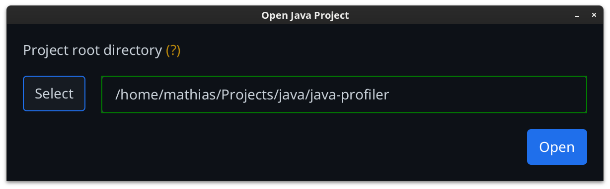
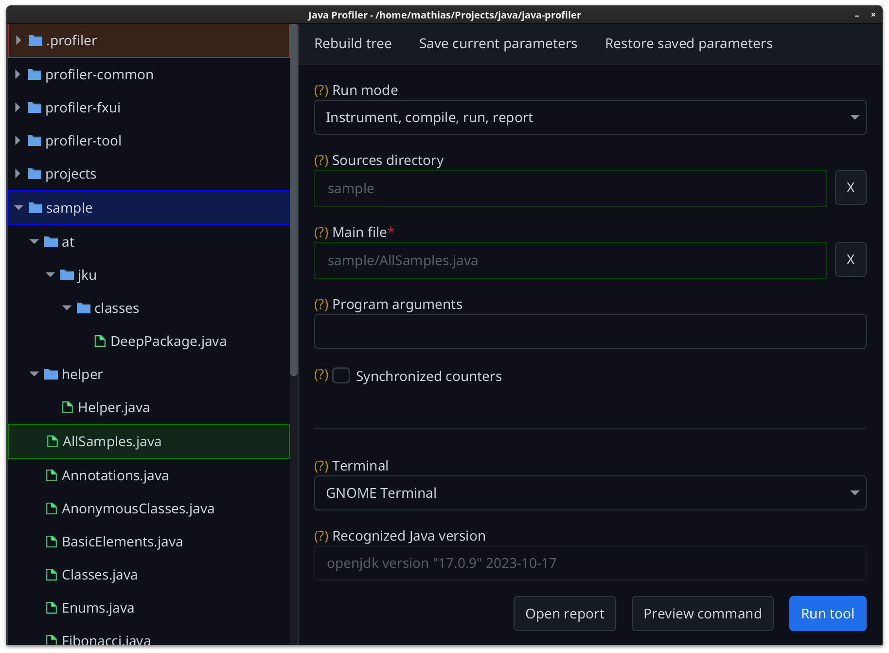

## FxUI

A graphical application (using th [JavaFX](https://openjfx.io/) toolkit) was created, to easily configure parameters and arguments
for the command-line tool. The profiler is then executed in a terminal.

Golden `(?)` labels can be hovered over for more information about each field.

### Open project dialog

Before displaying the main window, a project directory must be chosen, using a selection dialog.

Clicking "Select" will show the system's native dialog to choose a folder.
 
Alternatively, the path can be entered directly into the text field.

As soon as a valid folder path is entered, the main application window can be invoked with the "Open" button.

On the next program execution, the previously opened path will be pre-filled.

### Main application window

Using the file tree on the left, the sources directory and main file can be selected. Depending on the run mode
this may be required.
 
Assigning a file or directory to a parameter can be done with the <kbd>Return</kbd> key, or using the context menu
on a tree item.

The tree highlights important items in color:
- blue - selected sources directory,
- green - selected main file.
- brown - output directory

The menu bar allows rebuilding the file tree, and saving or restoring currently set parameters (will be saved in the
output directory as `parameters.dat`).

When clicking "Run tool", a system-native terminal (can be chosen) will be opened, to show program output and
to allow user input (for interactive programs).

The executed command can be previewed with the "Preview command" button.

"Open report" will only show up once the `.profiler/report/index.html` file exists.
Clicking it calls the system's default application for HTML files (browser).

### Theme

The UI uses the `PrimerDark` theme from [AtlantaFX](https://github.com/mkpaz/atlantafx) as a `userAgentStylesheet`.
