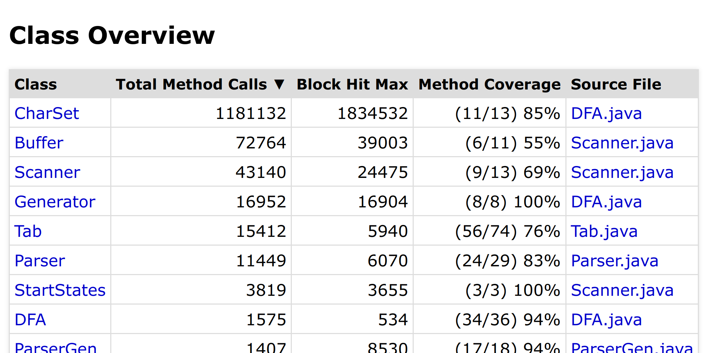
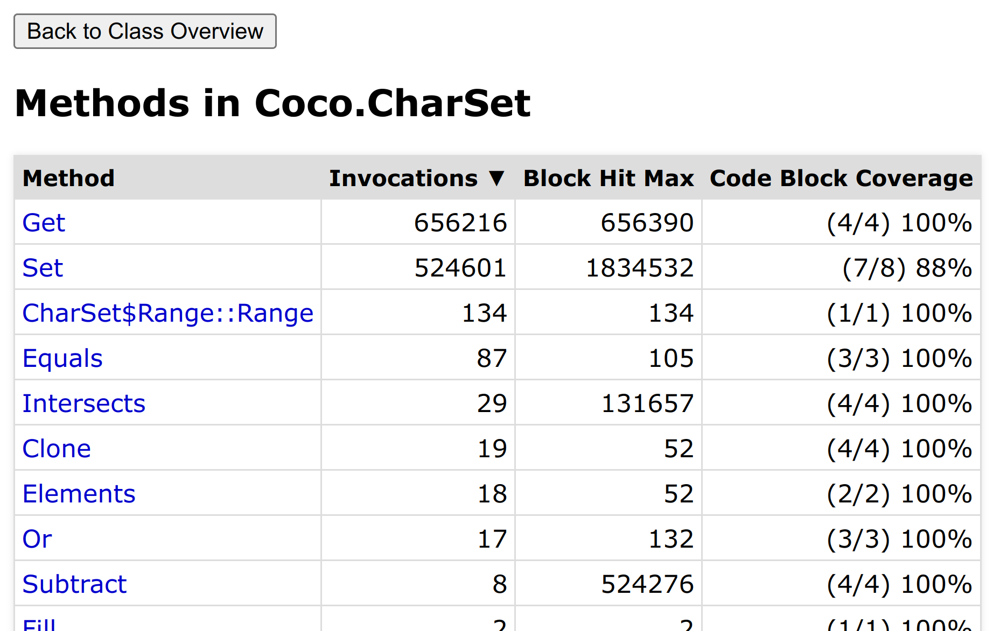
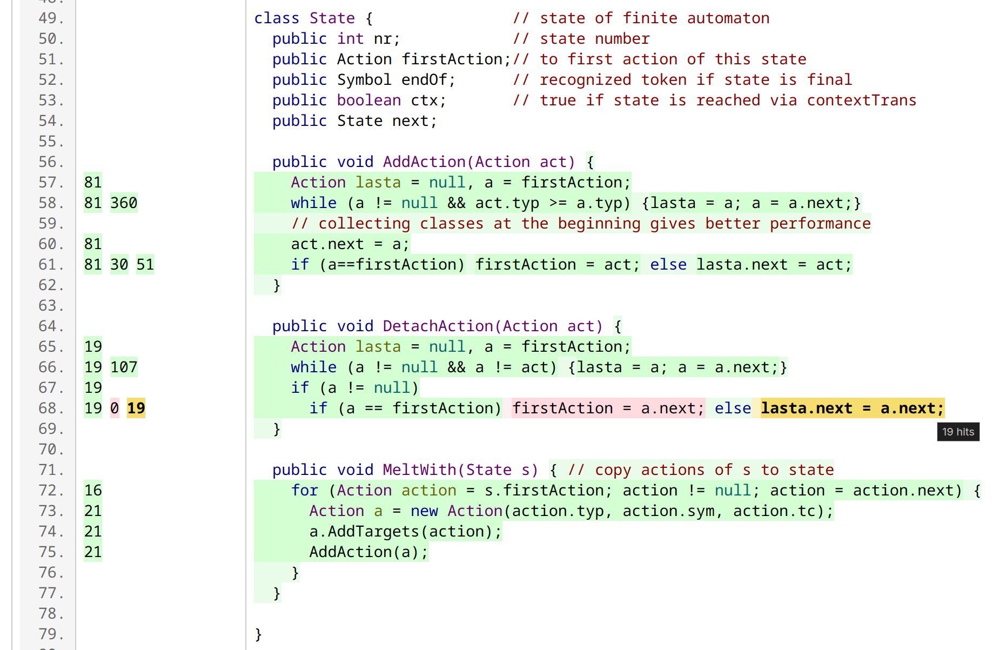

# Report

In the default run mode (or by using the `-r` mode) an HTML report will be generated inside the output directory.
 
It is stored in the `.profiler/report/` folder. The `index.html` file can be opened in a browser to view it.

## Classes (index.html)

The main index lists all classes found during parsing.
 

By default, the list is sorted by the aggregated invocation count of all methods in each listed class.
This enables us to quickly identify hotspots in the program for its last run. 
At the bottom of the list we find rarely or never used classes.

Two additional metrics are available:
- the method coverage in percent and
- the hit-count of the "hottest" block inside the whole class.

The columns are clickable and allow re-sorting of the rows by an alternative metric.

Clicking on the class name will open the "Methods" index for this class.
 
By clicking on the source file link, we can jump directly to the source file detail report.

## Methods (index_ClassName.html)

A separate method index is created for each *top-level* class.
 
It lists each non-abstract method, sorted by invocation count.

The heading displays the fully qualified name of the class.

Methods of inner classes are shown with the java class-file syntax: `Outer$Inner::Method`.
 
Anonymous and local classes get a numbered name `Outer$3::Method`, just like in the compiled class files.

Clicking on a method name will jump into the source detail report, to the line number of the method's declaration.

Browser-back or the top button can be used to return to the class overview.

## Source file detail report (JavaFileName.html)

For each Java file, an annotated source code file is generated inside `.profiler/report/source/`.
It can be used to explore each class and its method in detail.

A small [jQuery](https://jquery.com/) script [file](https://github.com/matwoess/jsourceprofiler/tree/main/jsourceprofiler-tool/src/main/resources/js/highlighter.js) initializes
colors for relevant sections and dynamically updates them on mouse hover.

Code blocks that have been entered at least once during program execution
are highlighted in green.
 
Non-covered blocks are displayed with red background color.

Statements with the same hit count are grouped into "code regions".
 
These regions are shown in a darker, more opaque green or red (depending on their coverage status).

The column, to the left of line numbers, contains the region hit counts for each line.
 
If multiple code regions are located in the same line, the hits are shown stacked next to each other.

Hovering over a block or region will highlight the entire block in
yellow and the current region in
orange. 
The current region's code will also become bold until moving the mouse away from the region.
 
Additionally, a popup-hint will show the number of hits.
